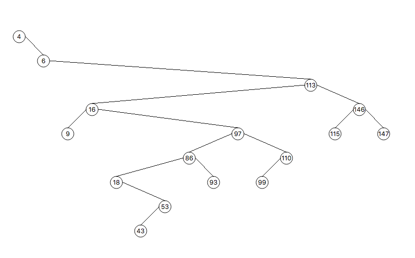
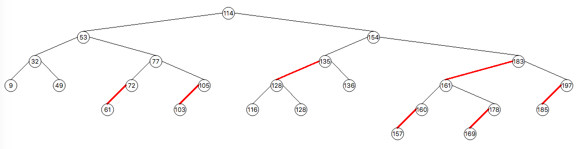

# bst_visualization
A QT program that can draw a simple (with no balancing mechanism) tree or a Red-Black (balanced) tree.
* Requires at least CMake 3.1.6 to compile and build.
* An environment variable named __CMAKE_Qt5_PATH__ must be set to the location of the Qt installation. Specifically something like: _...Qt/5.14.1/gcc_64/lib/cmake/Qt5Widgets/_ .

#### A BST Without Balancing Mechanism

#### A Red-Black \[balanced\] Tree

